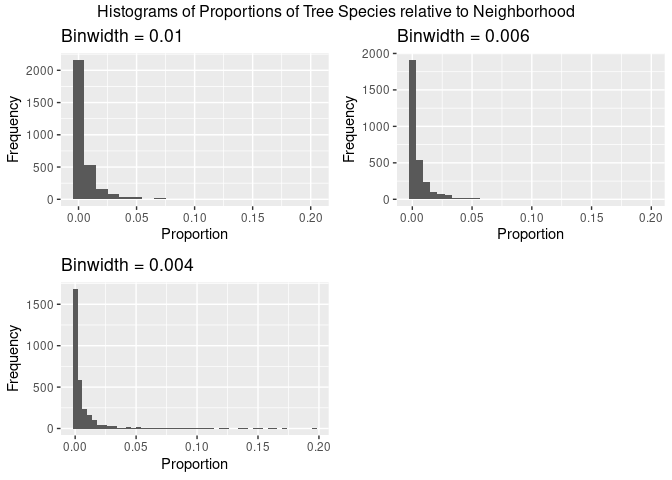
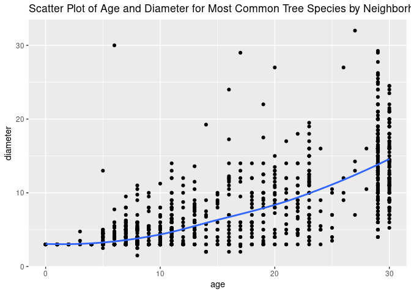
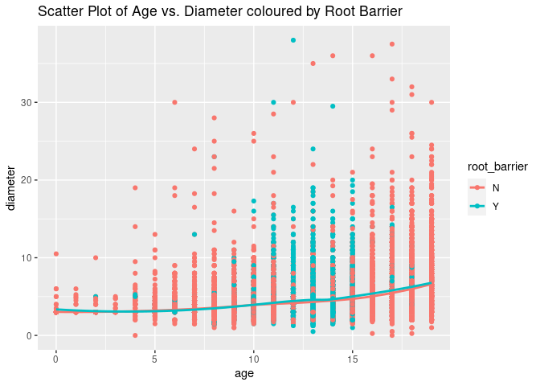
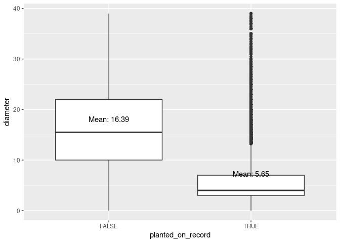

Mini Data Analysis Milestone 2
================

*To complete this milestone, you can either edit [this `.rmd`
file](https://raw.githubusercontent.com/UBC-STAT/stat545.stat.ubc.ca/master/content/mini-project/mini-project-2.Rmd)
directly. Fill in the sections that are commented out with `<!--- start
your work here--->`. When you are done, make sure to knit to an `.md`
file by changing the output in the YAML header to `github_document`,
before submitting a tagged release on canvas.*

# Welcome to the rest of your mini data analysis project\!

In Milestone 1, you explored your data. and came up with research
questions. This time, we will finish up our mini data analysis and
obtain results for your data by:

  - Making summary tables and graphs
  - Manipulating special data types in R: factors and/or dates and
    times.
  - Fitting a model object to your data, and extract a result.
  - Reading and writing data as separate files.

We will also explore more in depth the concept of *tidy data.*

**NOTE**: The main purpose of the mini data analysis is to integrate
what you learn in class in an analysis. Although each milestone provides
a framework for you to conduct your analysis, it’s possible that you
might find the instructions too rigid for your data set. If this is the
case, you may deviate from the instructions – just make sure you’re
demonstrating a wide range of tools and techniques taught in this class.

# Instructions

**To complete this milestone**, edit [this very `.Rmd`
file](https://raw.githubusercontent.com/UBC-STAT/stat545.stat.ubc.ca/master/content/mini-project/mini-project-2.Rmd)
directly. Fill in the sections that are tagged with `<!--- start your
work here--->`.

**To submit this milestone**, make sure to knit this `.Rmd` file to an
`.md` file by changing the YAML output settings from `output:
html_document` to `output: github_document`. Commit and push all of your
work to your mini-analysis GitHub repository, and tag a release on
GitHub. Then, submit a link to your tagged release on canvas.

**Points**: This milestone is worth 50 points: 45 for your analysis, and
5 for overall reproducibility, cleanliness, and coherence of the Github
submission.

**Research Questions**: In Milestone 1, you chose two research questions
to focus on. Wherever realistic, your work in this milestone should
relate to these research questions whenever we ask for justification
behind your work. In the case that some tasks in this milestone don’t
align well with one of your research questions, feel free to discuss
your results in the context of a different research question.

# Learning Objectives

By the end of this milestone, you should:

  - Understand what *tidy* data is, and how to create it using `tidyr`.
  - Generate a reproducible and clear report using R Markdown.
  - Manipulating special data types in R: factors and/or dates and
    times.
  - Fitting a model object to your data, and extract a result.
  - Reading and writing data as separate files.

# Setup

Begin by loading your data and the tidyverse package below:

``` r
library(datateachr) # <- might contain the data you picked!
library(tidyverse)
library(gridExtra)
library(here)
library(broom)
```

# Task 1: Process and summarize your data

From milestone 1, you should have an idea of the basic structure of your
dataset (e.g. number of rows and columns, class types, etc.). Here, we
will start investigating your data more in-depth using various data
manipulation functions.

### 1.1 (1 point)

First, write out the 4 research questions you defined in milestone 1
were. This will guide your work through milestone 2:

<!-------------------------- Start your work below ---------------------------->

**1. Which neighborhood has the most diverse trees?**

This question aims to measure the diversity of trees in each
neighborhood, going beyond just counting the number of species.

**2. Does neighborhood affect tree growth speed (by
diameter/height\_range\_id)?**

This question explores the relationship between neighborhood and the
growth speed of trees, specifically looking at the diameter or height
range.

**3. Does the existance of a root barrier have an influence on
diameter?**

This question investigates whether the presence of a root barrier
affects the diameter of trees. It involves comparing the distributions
of tree diameter with and without a root barrier.

**4. Were trees that have no value for date\_planted planted before the
start of the records?**

This question examines the relationship between missing values for the
date\_planted variable and the diameter or height range of trees. It
aims to determine if trees without a recorded planting date were planted
prior to the start of the data records.

<!----------------------------------------------------------------------------->

Here, we will investigate your data using various data manipulation and
graphing functions.

### 1.2 (8 points)

Now, for each of your four research questions, choose one task from
options 1-4 (summarizing), and one other task from 4-8 (graphing). You
should have 2 tasks done for each research question (8 total). Make sure
it makes sense to do them\! (e.g. don’t use a numerical variables for a
task that needs a categorical variable.). Comment on why each task helps
(or doesn’t\!) answer the corresponding research question.

Ensure that the output of each operation is printed\!

Also make sure that you’re using dplyr and ggplot2 rather than base R.
Outside of this project, you may find that you prefer using base R
functions for certain tasks, and that’s just fine\! But part of this
project is for you to practice the tools we learned in class, which is
dplyr and ggplot2.

**Summarizing:**

1.  Compute the *range*, *mean*, and *two other summary statistics* of
    **one numerical variable** across the groups of **one categorical
    variable** from your data.
2.  Compute the number of observations for at least one of your
    categorical variables. Do not use the function `table()`\!
3.  Create a categorical variable with 3 or more groups from an existing
    numerical variable. You can use this new variable in the other
    tasks\! *An example: age in years into “child, teen, adult,
    senior”.*
4.  Compute the proportion and counts in each category of one
    categorical variable across the groups of another categorical
    variable from your data. Do not use the function `table()`\!

**Graphing:**

6.  Create a graph of your choosing, make one of the axes logarithmic,
    and format the axes labels so that they are “pretty” or easier to
    read.
7.  Make a graph where it makes sense to customize the alpha
    transparency.

Using variables and/or tables you made in one of the “Summarizing”
tasks:

8.  Create a graph that has at least two geom layers.
9.  Create 3 histograms, with each histogram having different sized
    bins. Pick the “best” one and explain why it is the best.

Make sure it’s clear what research question you are doing each operation
for\!

<!------------------------- Start your work below ----------------------------->

#### Which neighborhood has the most diverse trees?

##### Compute the proportion and counts in each category of one categorical variable across the groups of another categorical variable from your data. Do not use the function `table()`\!

As I am interested in tree diversity, it makes sense to calculate how
many trees of each species occur in each neighborhood.

``` r
(species_counts <- vancouver_trees %>%
  group_by(neighbourhood_name, species_name) %>%
  summarize(count = n()) %>%
  mutate(proportion = count / sum(count)))
```

    ## `summarise()` has grouped output by 'neighbourhood_name'. You can override
    ## using the `.groups` argument.

    ## # A tibble: 3,056 × 4
    ## # Groups:   neighbourhood_name [22]
    ##    neighbourhood_name species_name   count proportion
    ##    <chr>              <chr>          <int>      <dbl>
    ##  1 ARBUTUS-RIDGE      ABIES              2   0.000387
    ##  2 ARBUTUS-RIDGE      ACERIFOLIA   X   103   0.0199  
    ##  3 ARBUTUS-RIDGE      ACUTISSIMA         5   0.000967
    ##  4 ARBUTUS-RIDGE      ALNIFOLIA         16   0.00310 
    ##  5 ARBUTUS-RIDGE      AMERICANA        225   0.0435  
    ##  6 ARBUTUS-RIDGE      AQUIFOLIUM         3   0.000580
    ##  7 ARBUTUS-RIDGE      ARIA              19   0.00368 
    ##  8 ARBUTUS-RIDGE      ARNOLDIANA X       4   0.000774
    ##  9 ARBUTUS-RIDGE      AUCUPARIA         16   0.00310 
    ## 10 ARBUTUS-RIDGE      AVIUM             15   0.00290 
    ## # ℹ 3,046 more rows

##### Create 3 histograms, with each histogram having different sized bins. Pick the “best” one and explain why it is the best.

A bin width of 0.06 is a good choice in this case because it strikes a
balance between capturing important patterns in the data and avoiding
excessive noise. The smooth and continuous histogram bars make the
visualization visually appealing and easy to interpret. Additionally, a
bin width of 0.06 aligns well with the granularity of the proportion
data, enhancing interpretability.

This plot makes sense because it allows us to see that most trees
species are relatively rare in neighborhoods.

``` r
histogram1 <- ggplot(species_counts, aes(x = proportion)) +
  geom_histogram(binwidth = 0.01) +
  labs(x = "Proportion", y = "Frequency") +
  labs(title = "Binwidth = 0.01")

histogram2 <- ggplot(species_counts, aes(x = proportion)) +
  geom_histogram(binwidth = 0.006) +
  labs(x = "Proportion", y = "Frequency") +
  labs(title = "Binwidth = 0.006")

histogram3 <- ggplot(species_counts, aes(x = proportion)) +
  geom_histogram(binwidth = 0.004) +
  labs(x = "Proportion", y = "Frequency") +
  labs(title = "Binwidth = 0.004")

grid.arrange(histogram1, histogram2, histogram3, nrow = 2, top = "Histograms of Proportions of Tree Species relative to Neighborhood")
```

<!-- -->

#### Does neighborhood affect tree growth speed?

##### Compute the *range*, *mean*, and *two other summary statistics* of **one numerical variable** across the groups of **one categorical variable** from your data.

Computing summary statistics for diameter makes sense for this task
because it allows us to compare this across neighborhoods. Diamater is a
first indicator for tree growth speed.

``` r
vancouver_trees <- vancouver_trees %>% mutate(neighbourhood_name = factor(neighbourhood_name))
(summary_stats <- vancouver_trees %>%
  group_by(neighbourhood_name) %>%
  summarise(
    mean = mean(diameter),
    median = median(diameter),
    sd = sd(diameter),
    min = min(diameter),
    max = max(diameter)
) %>% arrange(desc(mean)))
```

    ## # A tibble: 22 × 6
    ##    neighbourhood_name        mean median    sd   min   max
    ##    <fct>                    <dbl>  <dbl> <dbl> <dbl> <dbl>
    ##  1 KITSILANO                 14.4   12   10.8      0 317  
    ##  2 SHAUGHNESSY               14.3   12   11.3      0  99  
    ##  3 DUNBAR-SOUTHLANDS         13.9   12   11.0      0 305  
    ##  4 WEST POINT GREY           13.2   11    9.73     0  61.6
    ##  5 KERRISDALE                12.7   10    9.80     0 156  
    ##  6 WEST END                  12.1   10.5  8.26     1  55  
    ##  7 ARBUTUS-RIDGE             11.9   10    8.67     0  62  
    ##  8 RILEY PARK                11.8    9    9.28     0  99  
    ##  9 SOUTH CAMBIE              11.7    8    9.59     1 141  
    ## 10 KENSINGTON-CEDAR COTTAGE  11.7    9.5  8.93     0  99  
    ## # ℹ 12 more rows

##### Subsetting data for most common tree

Processing the data so we can create a visualization for one tree
species only for now. That way growth speed differences between species
do not bias the result.

``` r
tree_numbers <- vancouver_trees %>%
  group_by(species_name) %>%
  summarize(count = n()) %>%
  arrange(desc(count))

# creating a new variable that extracts the year from the date
vancouver_trees <- vancouver_trees %>%
  mutate(date_planted = as.Date(date_planted)) %>%
  mutate(year = year(date_planted))

# calculating the maximum age
max_year <- vancouver_trees %>%
  summarize(max_year = max(year, na.rm = TRUE)) %>%
  pull(max_year)

# Adding the new variable age, which is calculated by substracting year of planting from the maximum year
vancouver_trees <- vancouver_trees %>%
  mutate(age = max_year - year(date_planted))

most_common <- vancouver_trees %>%
  filter(species_name == as.character(tree_numbers[1, "species_name"]))
```

##### Create a graph that has at least two geom layers.

This graph visualizes the relationship between age and diameter for the
most common tree species. By using both the point and the line geom
layers, you can effectively convey two important aspects of the data:
the individual data points and the trend line representing the overall
relationship between age and diameter.

``` r
# removing outliers and NAs
most_common_flt <- most_common %>%
   mutate(z_score = abs((diameter - mean(diameter)) / sd(diameter))) %>%
  filter(z_score < 3) %>% 
  na.omit()

ggplot(most_common_flt, aes(x = age, y = diameter)) +
  geom_point() +
  geom_smooth(method = "loess", se = FALSE, fullrange = TRUE) +
  labs(title = "Scatter Plot of Age and Diameter for Most Common Tree Species by Neighborhood") +
  guides(color = "none")
```

    ## `geom_smooth()` using formula = 'y ~ x'

<!-- -->

#### Does the existance of a root barrier have an influence on diameter?

##### Compute the number of observations for at least one of your categorical variables. Do not use the function `table()`\!

This calculation makes sense for the question because it allows us to
compare the number of trees width and without a root barrier. By
additionally calculating the mean, median, standard deviation, minimum,
maximum, and count of observations for each category of the
root\_barrier variable, we can analyze the differences in diameter
between the two groups.

``` r
vancouver_trees <- vancouver_trees %>% mutate(root_barrier = factor(root_barrier))
(summary_stats <- vancouver_trees %>%
  group_by(root_barrier) %>%
  summarise(
    mean = mean(diameter),
    median = median(diameter),
    sd = sd(diameter),
    min = min(diameter),
    max = max(diameter),
    count = n()
) %>% arrange(desc(mean)))
```

    ## # A tibble: 2 × 7
    ##   root_barrier  mean median    sd   min   max  count
    ##   <fct>        <dbl>  <dbl> <dbl> <dbl> <dbl>  <int>
    ## 1 N            12.0      10  9.29   0     435 137455
    ## 2 Y             4.40      3  3.00   0.5    86   9156

###### Create a graph that has at least two geom layers.

This graph makes sense because it visualizes the relationship between
age and diameter while also considering the presence of a root barrier.
Diameter is relative to age so it makes sense to include this variable.

``` r
# removing outliers
van_trees_flt <- vancouver_trees %>%
  mutate(z_score = abs((diameter - mean(diameter)) / sd(diameter))) %>%
  filter(z_score < 3) 

# removing trees older than 20 years because they have no root barrier apparently
van_trees_flt_young <- van_trees_flt %>%
  filter(age < 20) %>%
  na.omit() 

(scatter_plot <- ggplot(van_trees_flt_young, aes(x = age, y = diameter, color = root_barrier)) +
  geom_point() +
  geom_smooth(method = "loess", se = FALSE, fullrange = TRUE, ) +
  labs(title = "Scatter Plot of Age vs. Diameter coloured by Root Barrier"))
```

    ## `geom_smooth()` using formula = 'y ~ x'

<!-- -->

#### Were trees that have no value for date\_planted planted before the start of the records?

##### Create a categorical variable with 3 or more groups from an existing numerical variable. You can use this new variable in the other tasks\! *An example: age in years into “child, teen, adult, senior”.*

I adapted this task to only create 2 groups.

``` r
# creating a new variable to determine if the tree was planted on record
van_trees_flt <- van_trees_flt %>% mutate(planted_on_record = factor(case_when(is.na(date_planted) ~ FALSE, !is.na(date_planted) ~ TRUE)))

(summary_stats <- van_trees_flt %>%
  group_by(planted_on_record) %>%
  summarise(
    mean = mean(diameter),
    median = median(diameter),
    sd = sd(diameter),
    min = min(diameter),
    max = max(diameter)
) %>% arrange(desc(mean)))
```

    ## # A tibble: 2 × 6
    ##   planted_on_record  mean median    sd   min   max
    ##   <fct>             <dbl>  <dbl> <dbl> <dbl> <dbl>
    ## 1 FALSE             16.4    15.5  8.38     0    39
    ## 2 TRUE               5.65    4    3.93     0    39

###### Create a graph that has at least two geom layers.

Using a boxplot with a text layer is a way to visually summarize and
compare the distribution and mean diameter of tree diamters for whether
the tree was planted on record or not

``` r
(summary_stats <- van_trees_flt %>% 
  group_by(planted_on_record) %>% 
  summarize(mean_diameter = mean(diameter, na.rm = TRUE)))
```

    ## # A tibble: 2 × 2
    ##   planted_on_record mean_diameter
    ##   <fct>                     <dbl>
    ## 1 FALSE                     16.4 
    ## 2 TRUE                       5.65

``` r
van_trees_flt %>% 
  ggplot(aes(x = planted_on_record, y = diameter)) +
  geom_boxplot() +
  geom_text(data = summary_stats, aes(x = planted_on_record, y = mean_diameter, label = paste("Mean:", round(mean_diameter, 2))),
            vjust = -1)
```

<!-- -->
<!----------------------------------------------------------------------------->

### 1.3 (2 points)

Based on the operations that you’ve completed, how much closer are you
to answering your research questions? Think about what aspects of your
research questions remain unclear. Can your research questions be
refined, now that you’ve investigated your data a bit more? Which
research questions are yielding interesting results?

<!------------------------- Write your answer here ---------------------------->

#### Answer

Based on the scatter plots that include diameter, I theorize that this
metric is not updated as the tree grows. There are many old trees that
don’t have enough diameter. All research questions including diameter
cannot be investigated further.

Root barriers only exist for trees that have a certain age (relatively
young trees), so this mostly explains the differences between the
statistics regaring diameter.

Comparing the statistics of trees with NA for date\_planted to those
without, it is most likely that NA equals to the fact that this trees
planting date was not recorded.

The diameter problem leaves us with the research question on the
diversity of trees. The histogram showed us that most trees are rare in
neighborhoods and we have calculated a dataframe that contains metrics
we can use to investigate further. The proportion of a tree species per
neighbourhood could be used to design an indicator for diversity. I will
define it as the number of tree species that are above a certain
threshold.

Based on this, I will add a new research question: Which tree species is
the most prevalent across the neighborhoods? This particular tree
species could be considered as the quintessential “Vancouver” tree due
to its widespread presence throughout the city.
<!----------------------------------------------------------------------------->

# Task 2: Tidy your data

In this task, we will do several exercises to reshape our data. The goal
here is to understand how to do this reshaping with the `tidyr` package.

A reminder of the definition of *tidy* data:

  - Each row is an **observation**
  - Each column is a **variable**
  - Each cell is a **value**

### 2.1 (2 points)

Based on the definition above, can you identify if your data is tidy or
untidy? Go through all your columns, or if you have \>8 variables, just
pick 8, and explain whether the data is untidy or tidy.

#### Answer

  - The “neighbourhood\_name” column represents the different
    neighborhoods.
  - The “species\_name” column represents the names of different
    species.
  - The “count” column indicates the number of occurrences of each
    species in each neighborhood.
  - The “proportion” column shows the proportion of each species count
    compared to the total count. In summary, the data follows the
    criteria for tidy data, where each row represents an observation,
    each column represents a variable, and each cell contains a value.

<!----------------------------------------------------------------------------->

### 2.2 (4 points)

Now, if your data is tidy, untidy it\! Then, tidy it back to it’s
original state.

If your data is untidy, then tidy it\! Then, untidy it back to it’s
original state.

Be sure to explain your reasoning for this task. Show us the “before”
and “after”.

#### Answer

I am untidying the data by using pivot\_wider() to convert the species
names to columns. Now, each rows contains multiple observations

``` r
(untidy_data <- species_counts %>%
  select(-count) %>%
  pivot_wider(names_from =  species_name, values_from = proportion))
```

    ## # A tibble: 22 × 284
    ## # Groups:   neighbourhood_name [22]
    ##    neighbourhood_name      ABIES `ACERIFOLIA   X` ACUTISSIMA ALNIFOLIA AMERICANA
    ##    <chr>                   <dbl>            <dbl>      <dbl>     <dbl>     <dbl>
    ##  1 ARBUTUS-RIDGE         3.87e-4          0.0199    0.000967  0.00310    0.0435 
    ##  2 DOWNTOWN              1.94e-4          0.0238    0.0130    0.000582   0.00969
    ##  3 DUNBAR-SOUTHLANDS     1.17e-3          0.0178    0.00244   0.00191    0.0462 
    ##  4 FAIRVIEW              1.75e-3          0.00475  NA         0.00150    0.0412 
    ##  5 GRANDVIEW-WOODLAND    5.97e-4          0.00940   0.00209   0.00104    0.0310 
    ##  6 HASTINGS-SUNRISE      3.79e-4          0.00664   0.00446   0.00616    0.0166 
    ##  7 KENSINGTON-CEDAR COT… 1.36e-3          0.00580   0.00734   0.00118    0.0677 
    ##  8 KERRISDALE            7.21e-4          0.00851   0.00115   0.000433   0.0490 
    ##  9 KILLARNEY             6.51e-4          0.00927   0.00130   0.000325   0.0335 
    ## 10 KITSILANO             2.09e-3          0.0174    0.00283   0.00197    0.0320 
    ## # ℹ 12 more rows
    ## # ℹ 278 more variables: AQUIFOLIUM <dbl>, ARIA <dbl>, `ARNOLDIANA X` <dbl>,
    ## #   AUCUPARIA <dbl>, AVIUM <dbl>, BABYLONICA <dbl>, BANKSIANA <dbl>,
    ## #   BETULUS <dbl>, BIGNONIOIDES <dbl>, BILOBA <dbl>, BLIREANA <dbl>,
    ## #   CALLERYANA <dbl>, CAMPESTRE <dbl>, CANADENSIS <dbl>, CAPPADOCICUM <dbl>,
    ## #   `CARNEA   X` <dbl>, CAROLINIANA <dbl>, CERASIFERA <dbl>, CINEREA <dbl>,
    ## #   CIRCINATUM <dbl>, COCCINEA <dbl>, CONTORTA <dbl>, CONTROVERSA <dbl>, …

The reverse can be done with pivot\_longer.

``` r
(tidy_data <- untidy_data %>%
  pivot_longer(cols = -neighbourhood_name, names_to = "species_name", values_to = "proportion"))
```

    ## # A tibble: 6,226 × 3
    ## # Groups:   neighbourhood_name [22]
    ##    neighbourhood_name species_name   proportion
    ##    <chr>              <chr>               <dbl>
    ##  1 ARBUTUS-RIDGE      ABIES            0.000387
    ##  2 ARBUTUS-RIDGE      ACERIFOLIA   X   0.0199  
    ##  3 ARBUTUS-RIDGE      ACUTISSIMA       0.000967
    ##  4 ARBUTUS-RIDGE      ALNIFOLIA        0.00310 
    ##  5 ARBUTUS-RIDGE      AMERICANA        0.0435  
    ##  6 ARBUTUS-RIDGE      AQUIFOLIUM       0.000580
    ##  7 ARBUTUS-RIDGE      ARIA             0.00368 
    ##  8 ARBUTUS-RIDGE      ARNOLDIANA X     0.000774
    ##  9 ARBUTUS-RIDGE      AUCUPARIA        0.00310 
    ## 10 ARBUTUS-RIDGE      AVIUM            0.00290 
    ## # ℹ 6,216 more rows

<!----------------------------------------------------------------------------->

### 2.3 (4 points)

Now, you should be more familiar with your data, and also have made
progress in answering your research questions. Based on your interest,
and your analyses, pick 2 of the 4 research questions to continue your
analysis in the remaining tasks:

<!-------------------------- Start your work below ---------------------------->

1.  Which neighbourhood has the most diverse trees?
2.  Which tree species is the most prevalent across the neighborhoods?

<!----------------------------------------------------------------------------->

Explain your decision for choosing the above two research questions.

<!--------------------------- Start your work below --------------------------->

As explained above, the state of original data does not allow for the
continuation of investigating the other research questions.
<!----------------------------------------------------------------------------->

Now, try to choose a version of your data that you think will be
appropriate to answer these 2 questions. Use between 4 and 8 functions
that we’ve covered so far (i.e. by filtering, cleaning, tidy’ing,
dropping irrelevant columns, etc.).

(If it makes more sense, then you can make/pick two versions of your
data, one for each research question.)

<!--------------------------- Start your work below --------------------------->

``` r
final_data <- species_counts %>%
  filter(count >= 50) %>%
  mutate(proportion = round(proportion, 3)) %>%
  select(-count) 

  distinct_neighbourhoods <- final_data %>%
    distinct(neighbourhood_name)
  
  distinct_neighbourhoods
```

    ## # A tibble: 22 × 1
    ## # Groups:   neighbourhood_name [22]
    ##    neighbourhood_name      
    ##    <chr>                   
    ##  1 ARBUTUS-RIDGE           
    ##  2 DOWNTOWN                
    ##  3 DUNBAR-SOUTHLANDS       
    ##  4 FAIRVIEW                
    ##  5 GRANDVIEW-WOODLAND      
    ##  6 HASTINGS-SUNRISE        
    ##  7 KENSINGTON-CEDAR COTTAGE
    ##  8 KERRISDALE              
    ##  9 KILLARNEY               
    ## 10 KITSILANO               
    ## # ℹ 12 more rows

# Task 3: Modelling

## 3.0 (no points)

Pick a research question from 1.2, and pick a variable of interest
(we’ll call it “Y”) that’s relevant to the research question. Indicate
these.

<!-------------------------- Start your work below ---------------------------->

**Research Question**: Does the existance of a root barrier have an
influence on diameter?

**Variable of interest**: diameter

<!----------------------------------------------------------------------------->

## 3.1 (3 points)

Fit a model or run a hypothesis test that provides insight on this
variable with respect to the research question. Store the model object
as a variable, and print its output to screen. We’ll omit having to
justify your choice, because we don’t expect you to know about model
specifics in STAT 545.

  - **Note**: It’s OK if you don’t know how these models/tests work.
    Here are some examples of things you can do here, but the sky’s the
    limit.
    
      - You could fit a model that makes predictions on Y using another
        variable, by using the `lm()` function.
      - You could test whether the mean of Y equals 0 using `t.test()`,
        or maybe the mean across two groups are different using
        `t.test()`, or maybe the mean across multiple groups are
        different using `anova()` (you may have to pivot your data for
        the latter two).
      - You could use `lm()` to test for significance of regression
        coefficients.

<!-------------------------- Start your work below ---------------------------->

``` r
vancouver_trees <- vancouver_trees %>%
  mutate(root_barrier = as.factor(root_barrier))

model = t.test(diameter ~ root_barrier, data = vancouver_trees)

print(model)
```

    ## 
    ##  Welch Two Sample t-test
    ## 
    ## data:  diameter by root_barrier
    ## t = 188.48, df = 23961, p-value < 2.2e-16
    ## alternative hypothesis: true difference in means between group N and group Y is not equal to 0
    ## 95 percent confidence interval:
    ##  7.483398 7.640679
    ## sample estimates:
    ## mean in group N mean in group Y 
    ##        11.96242         4.40038

<!----------------------------------------------------------------------------->

## 3.2 (3 points)

Produce something relevant from your fitted model: either predictions on
Y, or a single value like a regression coefficient or a p-value.

  - Be sure to indicate in writing what you chose to produce.
  - Your code should either output a tibble (in which case you should
    indicate the column that contains the thing you’re looking for), or
    the thing you’re looking for itself.
  - Obtain your results using the `broom` package if possible. If your
    model is not compatible with the broom function you’re needing, then
    you can obtain your results by some other means, but first indicate
    which broom function is not compatible.

<!-------------------------- Start your work below ---------------------------->

##### p-value

``` r
tidy_result <- tidy(model)
(p_value <- tidy_result$p.value)
```

    ## [1] 0

<!----------------------------------------------------------------------------->

# Task 4: Reading and writing data

Get set up for this exercise by making a folder called `output` in the
top level of your project folder / repository. You’ll be saving things
there.

## 4.1 (3 points)

Take a summary table that you made from Task 1, and write it as a csv
file in your `output` folder. Use the `here::here()` function.

  - **Robustness criteria**: You should be able to move your Mini
    Project repository / project folder to some other location on your
    computer, or move this very Rmd file to another location within your
    project repository / folder, and your code should still work.
  - **Reproducibility criteria**: You should be able to delete the csv
    file, and remake it simply by knitting this Rmd file.

<!-------------------------- Start your work below ---------------------------->

``` r
output_folder <- here("output")
csv_file <- file.path(output_folder, "species_counts_neighbourhood.csv")
write.csv(species_counts, file = csv_file)
```

<!----------------------------------------------------------------------------->

## 4.2 (3 points)

Write your model object from Task 3 to an R binary file (an RDS), and
load it again. Be sure to save the binary file in your `output` folder.
Use the functions `saveRDS()` and `readRDS()`.

  - The same robustness and reproducibility criteria as in 4.1 apply
    here.

<!-------------------------- Start your work below ---------------------------->

``` r
rds_file <- file.path(output_folder, "model_root_barrier.rds")
saveRDS(model, file = rds_file)
loaded_model <- readRDS(file = rds_file)
```

<!----------------------------------------------------------------------------->

# Overall Reproducibility/Cleanliness/Coherence Checklist

Here are the criteria we’re looking for.

## Coherence (0.5 points)

The document should read sensibly from top to bottom, with no major
continuity errors.

The README file should still satisfy the criteria from the last
milestone, i.e. it has been updated to match the changes to the
repository made in this milestone.

## File and folder structure (1 points)

You should have at least three folders in the top level of your
repository: one for each milestone, and one output folder. If there are
any other folders, these are explained in the main README.

Each milestone document is contained in its respective folder, and
nowhere else.

Every level-1 folder (that is, the ones stored in the top level, like
“Milestone1” and “output”) has a `README` file, explaining in a
sentence or two what is in the folder, in plain language (it’s enough to
say something like “This folder contains the source for Milestone 1”).

## Output (1 point)

All output is recent and relevant:

  - All Rmd files have been `knit`ted to their output md files.
  - All knitted md files are viewable without errors on Github. Examples
    of errors: Missing plots, “Sorry about that, but we can’t show files
    that are this big right now” messages, error messages from broken R
    code
  - All of these output files are up-to-date – that is, they haven’t
    fallen behind after the source (Rmd) files have been updated.
  - There should be no relic output files. For example, if you were
    knitting an Rmd to html, but then changed the output to be only a
    markdown file, then the html file is a relic and should be deleted.

Our recommendation: delete all output files, and re-knit each
milestone’s Rmd file, so that everything is up to date and relevant.

## Tagged release (0.5 point)

You’ve tagged a release for Milestone 2.

### Attribution

Thanks to Victor Yuan for mostly putting this together.
